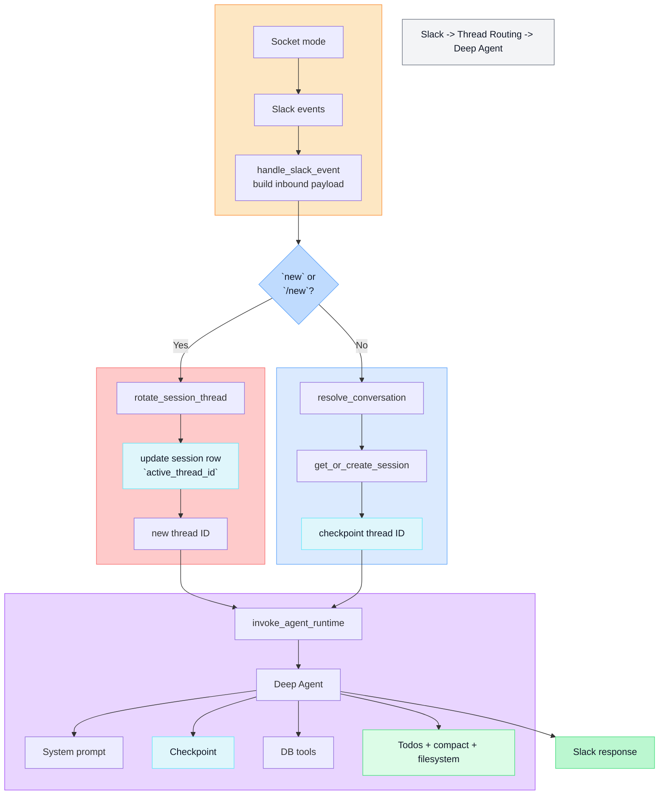
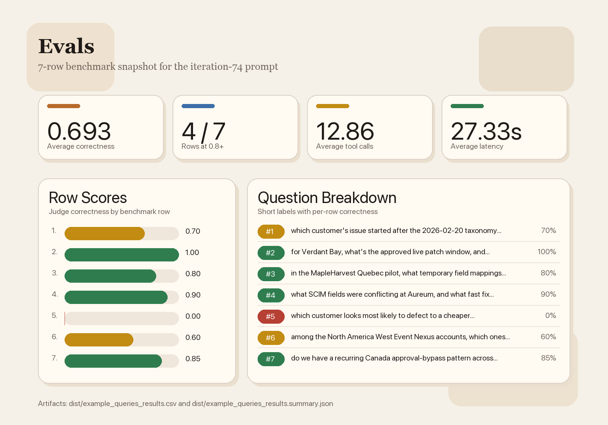

# slack-bot architecture

## Demo

The screen recording below shows a back-and-forth conversation with the Slack bot:

- [Watch the demo recording](./demo/slack-bot-demo.mp4)

## How to run

### 1. Configure environment variables

Create a local `.env` file from the example:

```bash
cp .env.example .env
```

Set these values in `.env` before starting the app:

- `OPENAI_API_KEY`: required for the agent runtime and eval scorer.
- `SLACK_BOT_TOKEN`: required to run the Slack app.
- `SLACK_APP_TOKEN`: required to run the Slack app in Socket Mode.

The current code expects the SQLite database file at `data/seed/synthetic_startup.sqlite`. If the file is missing, restore or place it there before starting the app.

### 2. Create the Slack app tokens

To get `SLACK_BOT_TOKEN` and `SLACK_APP_TOKEN`, create or open your Slack app at:

https://api.slack.com/apps

Slack docs for these token types:

- `SLACK_APP_TOKEN` setup: https://api.slack.com/apis/connections/socket
- `connections:write` scope details: https://api.slack.com/scopes/connections%3Awrite
- `SLACK_BOT_TOKEN` install and OAuth flow: https://api.slack.com/authentication/oauth-v2
- Slack token types overview: https://api.slack.com/concepts/token-types

Then configure:

1. Go to `Socket Mode` and enable it.
2. Create an app-level token with the `connections:write` scope.
   Use that value for `SLACK_APP_TOKEN`.
3. Go to `OAuth & Permissions`.
4. Add the bot scopes your app needs.
5. Install or reinstall the app to your workspace.
6. Copy the bot user OAuth token.
   Use that value for `SLACK_BOT_TOKEN`.

### 3. Start the application

To run the Slack bot API service and Postgres:

```bash
docker compose up --build api-service postgres
```

This starts:

- `postgres`: checkpointing and runtime state storage
- `api-service`: the Slack listener and deep-agent runtime

Once the app is running, open Slack and go to the channel associated with the Slack app installation for your bot token. In my setup, that channel is `slackbot_ai`, which I created for testing the bot conversation flow.

### 4. Slack app requirements

To use the Slack bot end to end, your Slack app needs:

- a bot token for `SLACK_BOT_TOKEN`
- an app-level token for `SLACK_APP_TOKEN`
- Socket Mode enabled



## Evals



## Containers

This project runs with three containers in `docker-compose.yml`:

- `postgres`: the Postgres container used for checkpointing and runtime state.
  Tables currently present in Postgres are `checkpoints`, `checkpoint_blobs`, `checkpoint_writes`, `checkpoint_migrations`, and `slack_conversation_sessions`.
- `api-service`: the backend container that spins up the deep-agent runtime and the Slack listener.
- `evals`: the eval container used to run the benchmark Q/A evaluations and to support autoresearch runs against those evals.

## Codebase structure

```text
src/
  app_logging.py                shared logging configuration
  agents/
    __init__.py                 exports the public agent runtime entrypoint
    builder.py                  builds and invokes the deep-agent runtime
    logging.py                  normalizes and logs graph/message output
    middleware.py               deep-agent guardrails middleware
    prompt.py                   single-agent system prompt
    schemas.py                  agent worker context, runtime answer, and model fallback types
  api_service/
    Dockerfile                  container image for the Slack API service
    main.py                     module entrypoint that runs the Slack server
    schemas.py                  Slack inbound message, response, conversation, and session shapes
    slack_server.py             Slack Bolt + Socket Mode event listeners and response/update flow
    slack_service.py            Slack session storage, routing, memory-budget logic, and agent calls
  config/
    __init__.py                 exports settings helpers
    settings.py                 environment-backed application settings
  database/
    __init__.py                 exports runtime dependency and SQLite helper functions
    checkpointer.py             Postgres pool/engine setup and LangGraph checkpoint dependencies
    sqlite.py                   SQLite inspection, validation, and query execution helpers
  evals/
    Dockerfile                  container image for benchmark/eval runs
    main.py                     eval runner, grading flow, and result export logic
  research_auto/
    main.py                     autoresearch loop for iterative prompt/model experimentation
  tools/
    __init__.py                 exports tool definitions
    database.py                 agent-facing tools for listing tables, inspecting columns, and executing SQL
docker-compose.yml              local orchestration for Postgres, api-service, and evals
```

> [!NOTE]
> **Things I tried**
> I tried `create_agent` single agents, deep agents with subagents using the DB tools, deep agents with tools directly, various tools, various middleware, skills with the deep agent, different OpenAI models, and Andrej Karpathy-style autoresearch.
>
> **Would I do a lot differently with more time?**
> Yes, lots.
>
> I gained a lot of insight into the tradeoffs, what was effective, and what was not. I'll talk more about my decisions and findings in [DESIGN.md](./DESIGN.md).
